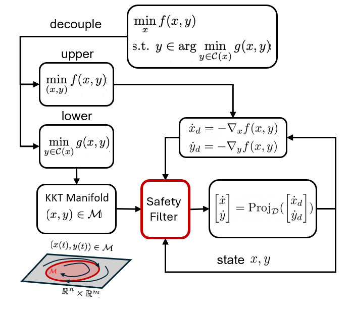
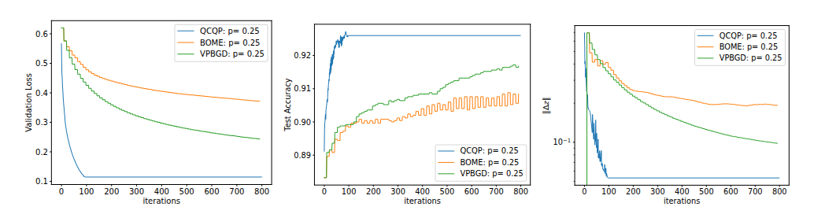

# SGF-BLO

Safe Bilevel Optimization contains implementations for bilevel optimization methods inspired by control theory.

This repository supports the experiments described in [**"Safe Gradient Flow for Bilevel Optimization"**](https://arxiv.org/abs/2501.16520), presented at the **2025 American Control Conference (ACC)**; [**"Sequential QCQP for Bilevel Optimization with Line Search"**](https://arxiv.org/abs/2505.14647), accepted at **IEEE Control Systems Letters (L-CSS)** and the **2025 Conference on Decision and Control (CDC)**; and [**"Perturbed gradient descent via convex quadratic approximation for nonconvex bilevel optimization"**](https://arxiv.org/abs/2504.17215), accepted at **Transactions on Machine Learning Research (TMLR)**.



## Setup

Create a Python environment and install the dependencies:

```bash
pip install -r requirements.txt
```

CUDA is optional. The code uses a GPU automatically when PyTorch detects one; otherwise it runs on CPU. The default QCQP implementation used in the experiments is closed form. If you enable the CVXPY/MOSEK branch in `utilities.py`, you will also need a working MOSEK installation and license.

## Quick Start

Run the default script:

```bash
bash run.sh
```

You can also run experiments directly:

```bash
python3 main.py --testID 0 --scenarioID 4
python3 main.py --testID 0 --scenarioID 5
python3 main.py --testID 4 --scenarioID 8 --plot_std --num_average 5
```

`main.py` is the main entry point. `--testID` selects the problem setup. `--scenarioID` selects a method comparison and hyperparameter configuration from `scenario_setup()` in `setup.py`; inspect that function to choose an existing scenario or add a new one.

## Problems

| `testID` | Problem |
|---:|---|
| 0 | Convex synthetic example (`toy_example`) |
| 1 | Nonconvex synthetic example (`toy_example_nc`) |
| 2 | Constrained synthetic example (`toy_example_cons`) |
| 3 | Small-scale coreset selection (`toy_CS`) |
| 4 | Data hyper-cleaning with PCA (`DHC`) |
| 5 | Large-scale data hyper-cleaning (`DHC_LS`) |
| 6 | Data hyper-cleaning with a neural network classifier (`NN`) |

## Methods

- `IFCT`: continuous-time method from "Safe Gradient Flow for Bilevel Optimization".
- `IFDT`: discrete-time method from "Sequential QCQP for Bilevel Optimization with Line Search" and "Perturbed gradient descent via convex quadratic approximation for nonconvex bilevel optimization". Modes include `QP1`, `QP2`, and `QCQP`.
- `SecondOrder`: prediction-correction method discussed in the appendix of "Safe Gradient Flow for Bilevel Optimization".

The `BilevelSolver` class in `bilevel_solver.py` contains the method implementations. Problem definitions and experiment configurations are in `setup.py`.

## Outputs

Raw result arrays are written to:

```text
Result/<experiment>/data/*.npy
```

Generated plots are written to:

```text
Result/<experiment>/*.pdf
```

The resulting plots have the following form:



## Citation

If you use this code in your work, please cite our papers:

```bibtex
@inproceedings{sharifi2025safe,
  title={Safe gradient flow for bilevel optimization},
  author={Sharifi, Sina and Abolfazli, Nazanin and Hamedani, Erfan Yazdandoost and Fazlyab, Mahyar},
  booktitle={2025 American Control Conference (ACC)},
  pages={1675--1680},
  year={2025},
  organization={IEEE}
}

@article{sharifi2025sequential,
  title={Sequential QCQP for Bilevel Optimization with Line Search},
  author={Sharifi, Sina and Hamedani, Erfan Yazdandoost and Fazlyab, Mahyar},
  journal={IEEE Control Systems Letters},
  year={2025},
  publisher={IEEE}
}

@article{abolfazli2025perturbed,
  title={Perturbed gradient descent via convex quadratic approximation for nonconvex bilevel optimization},
  author={Abolfazli, Nazanin and Sharifi, Sina and Fazlyab, Mahyar and Hamedani, Erfan Yazdandoost},
  journal={arXiv preprint arXiv:2504.17215},
  year={2025}
}
```
